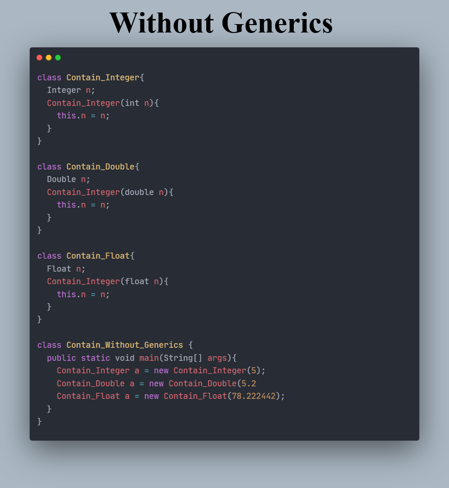
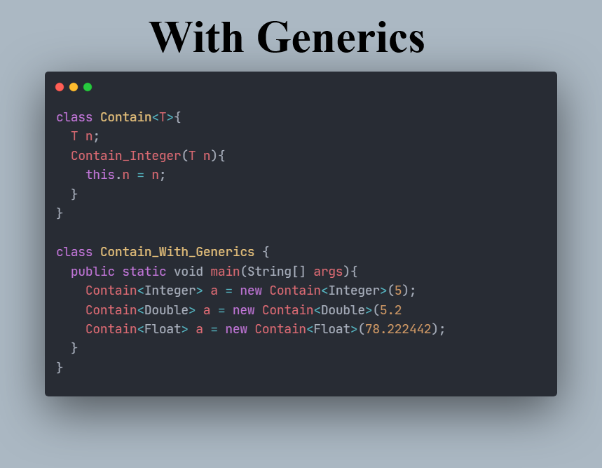

  

# JAVA Generics: A Comprehensive Guide
This repository provides a comprehensive guide to Generics in Java, 
covering fundamental concepts such as type parameters, wildcards,  
and generic methods. 

It includes examples and explanations to help both beginners  
and experienced Java developers implement Generics effectively.

# Table of Content
- Generics: The Concept
  - [With & Without generics](#with-&-without-generics)
  - [Parameterized types](#parameterized-types)
- Generics: Why we need it (Type Safety)
  - [The KeyPoint](#the-keypoint)
  - [The Presence](#the-presence)
  - [End-Note](#end-note)
- Generics: Bounded Types
  - [The Idea](#the-idea)
  - [Usecase (problem)](#usecase-problem)
  - [Usecase (bounded types as solution)](#usecase-bounded-types-as-solution)
  - [Interesting End-Note](#interesting-end-note)
- Generics: WildCard Arguments
  - [The Need](#the-need)
  - [The Concept](#the-concept)
  - [The Control](#the-control)
  - [Usecase](#usecase)
- Generics: Raw Type
  - [The Idea](#the-idea)
  - [The Conflict: Bypassing Type Safety](#the-conflict----bypassing-type-safety)
  - [The Warning](#the-warning)
  - [End Note](#end-note)
- Generics: Class Hierarchies
- Generics: Type Inference
- Generics: Implementation (Erasure)
  - [How it works](#how-it-works)
  - [Ambiguity errors](#ambiguity-errors)
  - [Bridge Methods](#bridge-methods)
- Generics: Restrictions

## Generics: The Concept
### With & Without generics
Through the use of generics, it is possible 
to create classes, interfaces, and methods 
that will work in a type-safe manner with various kinds of data.

You can define an algorithm (class) once,  
independent of any specific type of data, 
and then apply that algorithm to a wide variety of data types  
without additional effort. plus an added advantage of type safety. 

### Parameterized types
Generics means Parameterized types. 
such that the type our class works on  
is the type passed in as a parameter to the class.

Parameterized types are important because they enable you  
to create `classes`, `interfaces` and `methods` in which  
the type of data upon which they operate is specified as a parameter.

In pre-generic code, 
Generalized classes, Generalized interfaces, Generalized methods 
used Object Reference to operate on various types of objects. 
the problem was that they could not do so with type safety.
More on this later

## Generics: Why we need it (Type Safety)
Generics Power with respect to type safety involves:
* Explicit Casting
* Type Mis-match Detection

### The KeyPoint
One key point to understand about generic types 
is that a reference of one specific version of a generic type 
is not compatible with another version of the same generic type. 
This is How generics add type safety and prevent errors.

Also, when declaring an instance of a generic type 
the type argument passed must be a `Reference Type`.

### The Presence
Can we add the features of Generics in a non-generic environment? 
if so, why the presence of the generic feature.

Hmmm, yes we can, by simply specifying `Object` 
as the data type and employing the proper cast.

We have two problems with this approach 
* Explicit Casts must be employed to retrieve the stored data
* Many knds of Type mismatch errors connot be found until after compilation.

Notice `iOb = strOb;` which is syntactically valid because:
* all NonGen reference are the same
* any NonGen reference can refer to any other NonGen Object 
  and that is where the problem of type mis-match comes in. 
  such that it is possible for iOb to refer to an Object 
  that stores a String and not an Integer.

### End-Note
The Ability to create Type-safe code in which type mis-match errors  
are caught at compile time is a key advantage of generics.

## Generics: Bounded Types
### The Idea
Type Parameters could be replaced by any class type 
but sometimes it is useful to limit the types 
that can be passed to a type parameter. 
this is important and we would see a usecase soon.

When specifying a type parameter, 
you can create an upper bound that declares the superclass 
from which all type arguments must be derived.

`<T extends superclass>`

This specifies `T` can only be replaced by  
superclass or subclass of that superclass. 
thus, that superclass defines an inclusive, upper limit.

### Usecase (problem)
you want to create a generic class that contains a method 
that returns the average of an array of numbers.

the line `sum += nums[i].doubleValue();` causes compile error 
because the compiler has no way to know that you are intending 
to create Stats Object using only numeric types.

Thus when compiled, an error reports that indicates 
`The doubleValue() method is unknown`

### Usecase (bounded types as solution)

### Interesting End-Note
in Addition to using A class type as a bound 
you can also use an interface type (now things are getting interesting)

Furthermore, A bound can include 
both a class type and one or more interface types.

`<T extends interface_name>`
`<T extends class_name & interface_name1>`
`<T extends interface_name1 & interface_name2>`

As a point of interest, 
you can also use a type intersection in a cast.
`(generic_class1 & generic_class2) genericObject;`

## Generics: WildCard Arguments
### The Need
As useful as type safety is, sometimes it can 
get in the way of a perfectly acceptable construct.

Assume you want to add a method called `isSameArg()` 
that determines if two `Stats Object` contain arrays 
that yields the same avarage, no matter what type of numeric data 
the Stats Object holds whether or `Double Type` or `Integer Type`

The problem with the isSameArg() method aboveis the limitation  
that it only compares Stats Object of the same Type Parameter.  
It cannot compare btw a Double Stats Object and an Integer Stats Object. 

This is where the concept of Generic WildCard Arguments come in.

### The Concept
To Create a general isSameArg() method, 
you must use another feature of JAVA generics which is `The wildcard Argument`. 
It is specified by `?` instead of an Alphabeth.

### The Control
It is important to understand, 
the wild card simple matches any valid Stats Object.

Thus to have control on the Stats Object that matches, 
you simply use an `extend clause` to specify an upper-bound, 
or simple use a `super clause` to specigy a lower-bound.

`class_Name<? extends [class_names] & [interface_names]>`
`class_Name<? super subclass>`

### Usecase

## Generics: Raw Type
### The Idea
Because support for generics did not exist prior to JDK 5  
it was necessary to provide some transition path from old pre-generic code.

this transition path had to enable pre-generic code to remain functional 
while at the same time being compatible with generics.

To Enable this transition path gave birth to a concept called `The Raw Type of a Class`.  
Such that a Generic class could be used as if it's a normal class 
and also it could still be used as a generic class.

First Thing to know when creating a Raw Type, 
notice that no type argument are specified when a Gen Object is created. 
In Essesnce, this creates a Gen Object whose type `T` is replaced by `Object`. 

Secondly, because at run-time, the type of ob is `Object`, 
there must be a cast to obtain its value as a type `double`

### The Conflict -- Bypassing Type Safety

A Raw Type is not Type Safe. Thus, the variable of a raw type 
can be assigned a reference to any type of Gen Object
for example `raw = iOb;`

Also the variable of a specific Gen type  
can be assigned a reference to a raw Gen Object. e.g `strOb = raw;`

<b>Lets have a Clear look</b> 

Because `strOb` is of type `Gen<String>`, it is assumed to contain a string. 
However, after the assignment, the object referred to by strOb contains a Double. 
Thus at run time when an attempt is made to assign the contents of strOb to str, 
a run-time error results because strOb now contains a Double.

Here, A Generic Reference is assigned to a raw reference variable. 
`raw` now refers to an object that contains and Integer Object. 
But the case assumes that it contains Double. 
this error cannot be prevented at compile time, rather it causes a run time error.

### The Warning
Because of the potential for danger inherent in Raw Types, 
`Javac` displays `Unchecked warnings` when a Raw Type is used   
in a way that might jeopardize type safety.

### End Note
You should limit the use of raw types to those cases 
in which you must mix legacy code with newer, generic code. 
Raw Types are simply a transitional feature 
and not something that should be used for new code.

## Generics: Class Hierarchies
Generic class can be a part of a class hierarchy 
in just the same way as a non-generic class.

The Key Difference between Generic and Non-Generic Hierarchies 
is that in a generic hierarchy, any type argument needed by a generic superclass 
must be passed up the hierarchy by all subclasses.

This is similar to the way that constructor arugments must be passed up a hierarchy 
or how class implementation of a Generic interface, 
must pass up type parameters needed by the interface.

Similar to normal class hierarchies, concepts like 
`instanceOf`, `casting` and `method Overidding` still holds. 
Typical Right!!

## Generics: Type Inference

Basically, When using Generics, we can use shorter syntax.
which helps us not to repeat our selves.
This is where Type Inference comes in. Have a look.

## Generics: Implementation (Erasure)
An important constraint that govern the way that generics were added to JAVA 
was the need for compatibility with previous versions of JAVA.

The way JAVA implements generics while satisfying  
this constraint is through the use of `Erasure`.

### How it works
When Your Java Code is compiled,  
All Generic type information is removed (erased).
This means Replacing type parameter with their bound type
which Object if no explicit bound is specified.

Then applying the appropriate c
### Ambiguity errors
### Bridge Methods

## Generics: Restrictions

